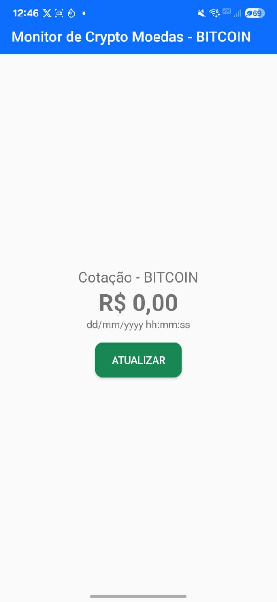

# Crypto Monitor, monitoramento do preço de criptomoedas em um clique!
Esse app mostra o valor do bitcoin em reais usando a API do Mercado Bitcoin com o clique do botão "Atualizar".

## Tela inicial
## Após entrar no aplicativo, a primeira tela será a seguinte:

## -
## Após clicar no botão "Atualizar" o valor do bitcoin e o tempo da cotação será mostrado na tela:

- [Estrutura do Projeto](estrutura_projeto.md)
- [Tecnologias Utilizadas](tecnologias_utilizadas.md)
- [Explicação do Código](explicacao_codigo.md)
- [Layouts XML](layouts.md)
- [MainActivity](mainactivity.md)
