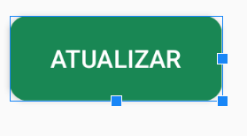
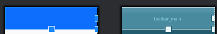
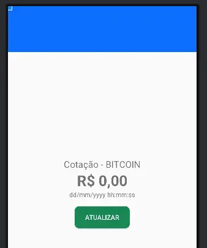

## Layout para o usuário (XML)

### values/Strings.xml
*Primeiro, definimos o nome do "Header", chamada de app title:*
```
<string name="app_title">Monitor de Crypto Moedas - BITCOIN</string>
```
*Segundo, definimos o "Label_rate", que é a legenda da cotação:*
```
<string name="label_rate">Cotação - BITCOIN</string>
```
*Terceiro, definimos o "Label_value", que é o valor da cotação:*
```
<string name="label_value">R$ 0,00</string>
```
*Quarto, definimos o "Label_date", que é a data da cotação:*
```
<string name="label_date">dd/mm/yyyy hh:mm:ss</string>
```
*Por fim, definimos o "Label_refresh", que é o botão para atualizar a cotação:*
```
<string name="label_refresh">Atualizar</string>
```
### values/colors.xml
*Definimos duas cores para o aplicativo, a cor azul para o header e a cor "Success" (verde) para o botão "atualizar":*
```
<color name="primary">#0d6efd</color>
<color name="success">#198754</color>
```
### drawable/shape_button_refresh.xml
*Definimos o formato do botão:*
```
<shape xmlns:android="http://schemas.android.com/apk/res/android">
     <solid android:color="@color/success" />
     <corners android:radius="10dp" />
</shape>
```
Fizemos isso pois assim podemos usar o mesmo modelo para criar outros botões, facilitando a reutilização.

### layout/component_button_refresh.xml
*Implementamos o componente do botão atualizar:*
Colocamos um id para identificar no main activity:
```
android:id="@+id/btn_refresh"
```
*Depois ajustamos a largura em densidade por pixel (width), a altura baseada no conteudo dentro do botão (height wrap_content)
Apos isso, definimos o fundo do botão com o shape_button_refresh.xml, reaproveitando o modelo criado:*
```
background="@drawable/shape_button_refresh"
```
o texto que herdamos das strings e por fim, a cor do botão:
```
textColor="@color/white"

```

### layout/component_quote_information.xml
*Nesse componente, implementamos 3 text views, que herdam do componente string, e um include do componente_button_refresh.xml.
Primeiro, o textview da "Cotação - BITCOIN", onde definimos o id*
```
android:id="@+id/lbl_rate"
android:id="@+id/lbl_value"
android:id="@+id/lbl_date"

```

*Segundo, o textview do valor em reais do bitcoin "R$ 0,00". Deixamos a fonte em negrito e com um texto com tamanho de 32sp (android:textSize="32sp"
android:textStyle="bold") onde definimos o id (android:id="@+id/lbl_value")
Terceiro, o textview da data da cotação "dd/mm/yyyy hh:mm:ss" onde definimos o id (android:id="@+id/lbl_date")
E por fim, incluimos o componente do botão atualizar.
Todos os componentes tem uma coisa em comum, centralizamos eles usando o center la no linear layout*

```
RESULTADO FINAL:

```


### layout/component_toolbar_main.xml
*Aqui, colocamos o "header" do nosso aplicativo, chamado de toolbar. (androidx.appcompat.widget.Toolbar)*
```
android:id="@+id/toolbar_main"
android:layout_width="match_parent"
android:layout_height="100dp"
android:theme="@style/ThemeOverlay.AppCompat.ActionBar"
app:popupTheme="@style/ThemeOverlay.AppCompat.Light"

```
*Definimos o id (android:id="@+id/toolbar_main")
definimos que em largura, ele vai ocupar toda a largura do pai (pai seria a largura do telefone que voce esta usando):
android:layout_width="match_parent"
Depois definimos a altura (android:layout_height="100dp")
Apos disso, definimos a cor que declaramos la no color, que seria a cor azul, chamada de @color/primary
Por fim, as duas linhas definem o estilo da sobreposição (o texto que vai aparecer com o titulo)
android:theme="@style/ThemeOverlay.AppCompat.ActionBar"*

*Resultado final:*


### layout/activity_main.xml
*No activity_main, apenas vamos incluir o que ja fizemos com os layouts anteriores em uma unica tela.
Incluimos o component toolbar e o component quote information.*

```
<include
android:id="@+id/component_toolbar"
layout="@layout/component_toolbar_main"
android:layout_width="match_parent"
android:layout_height="75dp"
android:layout_weight="0" />
```
```
<include
android:id="@+id/component_quote_information"
layout="@layout/component_quote_information"
android:layout_width="match_parent"
android:layout_height="0dp"
android:layout_weight="1" />
```

Com isso, temos esse resultado final:




- [Estrutura do Projeto](estrutura_projeto.md)
- [Tecnologias Utilizadas](tecnologias_utilizadas.md)
- [Explicação do Código](explicacao_codigo.md)
- [Layouts XML](layouts.md)
- [MainActivity](mainactivity.md)
