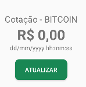

### Layout para o usuário (XML)

- values/Strings.xml
<string name="app_title">Monitor de Crypto Moedas - BITCOIN</string>
<string name="label_rate">Cotação - BITCOIN</string>
<string name="label_value">R$ 0,00</string>
<string name="label_date">dd/mm/yyyy hh:mm:ss</string>
<string name="label_refresh">Atualizar</string>

- values/colors.xml
<color name="primary">#0d6efd</color>
<color name="success">#198754</color>

- drawable/shape_button_refresh.xml
<shape xmlns:android="http://schemas.android.com/apk/res/android">
     <solid android:color="@color/success" />
     <corners android:radius="10dp" />
</shape>

- layout/component_button_refresh.xml
android:id="@+id/btn_refresh"
background="@drawable/shape_button_refresh"
textColor="@color/white"

- layout/component_quote_information.xml
android:id="@+id/lbl_rate"
android:id="@+id/lbl_value"
android:id="@+id/lbl_date"

- layout/component_toolbar_main.xml
android:id="@+id/toolbar_main"
android:layout_width="match_parent"
android:layout_height="100dp"
android:theme="@style/ThemeOverlay.AppCompat.ActionBar"
app:popupTheme="@style/ThemeOverlay.AppCompat.Light"

- layout/activity_main.xml
<include android:id="@+id/component_toolbar" layout="@layout/component_toolbar_main"/>
<include android:id="@+id/component_quote_information" layout="@layout/component_quote_information"/>

