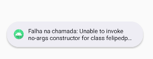

### MainActivity

*Agora, chegamos ao MainActivity, ele vai ser o responsavel por integrar a atualização de UI com as ações do usuário.
fizemos alguns imports necessarios, como o MercadoBitcoinServiceFactory, essencial para chamar a API apos o clique do botão.
Alem das utils, como a data, local da data, formato da cotação, etc...*

```
import android.os.Bundle
import android.widget.Button
import android.widget.TextView
import android.widget.Toast
import androidx.appcompat.app.AppCompatActivity
import androidx.appcompat.widget.Toolbar
import java.text.NumberFormat
import java.text.SimpleDateFormat
import java.util.Date
import java.util.Locale
```
*Também importamos as classes relacionadas à API e ao serviço:*
```
import com.example.cryptomonitor.api.MercadoBitcoinServiceFactory
import com.example.cryptomonitor.model.TickerResponse
```

A MainActivity herda de AppCompatActivity para usar os recursos de UI. (class MainActivity : AppCompatActivity())
class MainActivity : AppCompatActivity():

```
override fun onCreate(savedInstanceState: Bundle?) {
    super.onCreate(savedInstanceState)
    setContentView(R.layout.activity_main)
    
    // Configuração da toolbar
    val toolbarMain: Toolbar = findViewById(R.id.toolbar_main)
    configureToolbar(toolbarMain)
    
    // Configuração do botão de atualização
    val btnRefresh: Button = findViewById(R.id.btn_refresh)
    btnRefresh.setOnClickListener {
        makeRestCall()
    }
}
```

setContentView(R.layout.activity_main): Define o layout da atividade (activity_main.xml)

Depois disso, configuramos a toolbar e chamavamos ela pelo ID: val toolbarMain: Toolbar = findViewById(R.id.toolbar_main)
configureToolbar(toolbarMain)

```
private fun configureToolbar(toolbar: Toolbar) {
setSupportActionBar(toolbar): Configura a toolbar como a barra de ação da atividade.
toolbar.setTitleTextColor(getColor(R.color.white)) : Define a cor do texto da toolbar para branco.
supportActionBar?.setTitle(getText(R.string.app_title)) : Define o título da toolbar com base na string definida em strings.xml.
supportActionBar?.setBackgroundDrawable(getDrawable(R.color.primary)) : Define a cor de fundo da toolbar com base no valor definido em colors.xml.
}
```
Depois, nos vamos chamar e configurar o botão refresh:
val btnRefresh: Button = findViewById(R.id.btn_refresh)
btnRefresh.setOnClickListener : Define um ouvinte para o clique no botão, que chama a função makeRestCall() quando o botão é clicado. O Listener vai ouvir a ação do usuario e executar com o clique do botão.

Agora vamos fazer uma função chamada makeRestCall() que vai fazer a requisição à API.
```
val service = MercadoBitcoinServiceFactory().create(): Cria uma instância do MercadoBitcoinService usando o MercadoBitcoinServiceFactory.
val response = service.getTicker(): Faz a chamada à API e armazena a resposta na variável response.

if (response.isSuccessful): Se a resposta for bem sucedida
```
busca no layout o componente do valor e da data para fazer a alteração desses valores:
```
val lblValue: TextView = findViewById(R.id.lbl_value)
val lblDate: TextView = findViewById(R.id.lbl_date)
```
com o val lastValue, ele verifica o ultimo valor da cotação e formata como moeda brasileira
```
val lastValue = tickerResponse?.ticker?.last?.toDoubleOrNull()
if (lastValue != null) {
val numberFormat = NumberFormat.getCurrencyInstance(Locale("pt", "BR"))
lblValue.text = numberFormat.format(lastValue)
}
```
Com o val date, ele pega a data da cotação e transforma em data legível
```
val date = tickerResponse?.ticker?.date?.let { Date(it * 1000L) }
val sdf = SimpleDateFormat("dd/MM/yyyy HH:mm:ss", Locale.getDefault())
lblDate.text = sdf.format(date) // Exibe a data formatada
```
Se ele não for bem sucedido, ele vai devolver o erro em um formato de toast, com os seguintes erros:
```
val errorMessage = when (response.code()) {
400 -> "Bad Request" : A requisição foi mal feita ou falta algum dado obrigatório.
401 -> "Unauthorized" : A API não autorizou o acesso ou é necessario uma chave de acesso
403 -> "Forbidden" : Voce nao tem permissao de acesso.
404 -> "Not Found" : o recurso nao foi encontrado ou não existe.
else -> "Unknown error" : erro desconhecido
```
Ao final, tem os toasts, que são baloes cinzas na parte inferior na tela.

O erro deve aparecer desta maneira:



- [Estrutura do Projeto](estrutura_projeto.md)
- [Tecnologias Utilizadas](tecnologias_utilizadas.md)
- [Explicação do Código](explicacao_codigo.md)
- [Layouts XML](layouts.md)
- [MainActivity](mainactivity.md)
